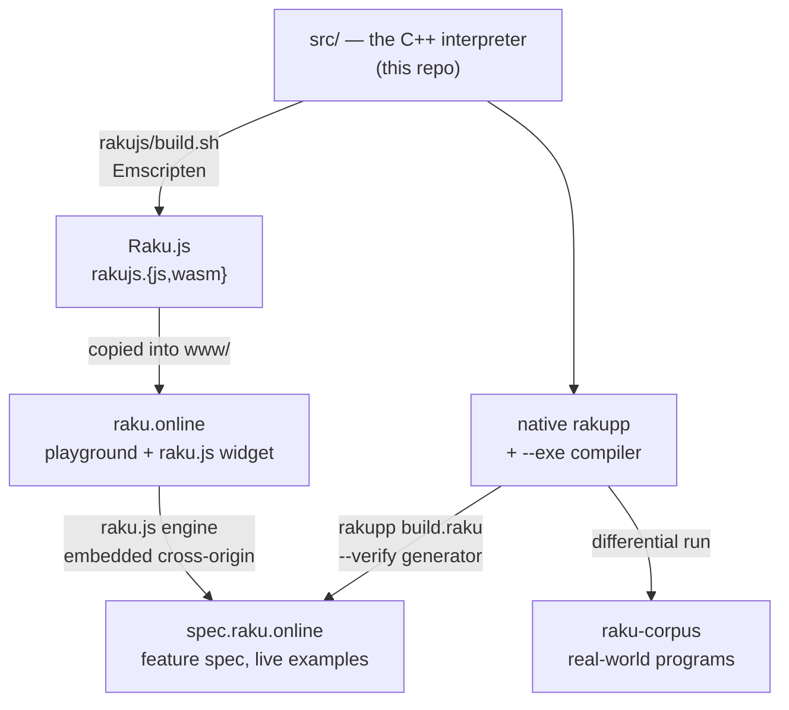

# The Raku++ ecosystem

Raku++ is not just the interpreter — it is the hub of a small constellation of
projects that all trace back to the same C++ source in [`../src`](../src). This
page is the map: what each piece is, where it lives, and — crucially — **the
runbook for what to rebuild and redeploy after a release**, so nothing is left
on a stale interpreter.

## The pieces

Everything downstream ships the *same* interpreter. Raku.js is `../src` compiled
to WebAssembly; the two sites embed that WebAssembly; the corpus is test input
run against the native binary. There is one implementation, presented four ways.

| Project | What it is | Repository | Local checkout | Serves |
|---|---|---|---|---|
| **Raku++ (rakupp)** | The interpreter + native compiler in C++17. Source of truth for everything below. | [ash/rakupp](https://github.com/ash/rakupp) | *this repo* | native binary, `--exe` |
| **Raku.js** | `../src` compiled to WebAssembly (Emscripten) — Raku in the browser, no server. Additive: nothing in `../src` is modified. | (part of rakupp, [`rakujs/`](../rakujs/README.md)) | `rakujs/` | `rakujs.{js,wasm}` |
| **raku.online** | The public playground built on Raku.js — editor, output pane, share/open links, an embeddable widget (`raku.js`). | [ash/raku.online](https://github.com/ash/raku.online) | `/Users/ash/raku.online` | [raku.online](https://raku.online/) |
| **raku-spec** | The behavioural spec: one page per feature, every example runnable live (via raku.online's engine). Its generator is written in Raku and run *by* rakupp. | [ash/raku-spec](https://github.com/ash/raku-spec) | `/Users/ash/raku-spec` | [spec.raku.online](https://spec.raku.online/) |
| **raku-corpus** | Real-world Raku programs used as a beyond-Roast differential test target. | [ash/raku-corpus](https://github.com/ash/raku-corpus) | *(clone as needed)* | — (test input) |

## How they connect



Two things are worth internalising because they drive the release runbook:

- **The version string flows from one place.** `rakujs/build.sh` reads the
  version out of [`../CMakeLists.txt`](../CMakeLists.txt)
  (`project(RakuPP VERSION …)`) and bakes it into the WebAssembly build. Bump the
  version there *before* rebuilding wasm and every surface reports it correctly.
- **spec.raku.online hosts no engine of its own.** Its runnable examples load
  raku.online's `raku.js`, which `importScripts` the same `rakujs.{js,wasm}`. So
  **the spec automatically inherits a new interpreter the moment raku.online is
  redeployed** — updating the spec is then only about the *content* (new feature
  pages), not the engine.

---

## Release runbook — what to rebuild after a new version

Do these in order. Steps A–B are required for every release; C is required
whenever the release adds or changes user-visible behaviour; D is a safety net.

### A. Cut the release (in this repo)

1. **Bump the version** — the single source of truth is
   [`CMakeLists.txt`](../CMakeLists.txt): `project(RakuPP VERSION X.Y.Z …)`.
   Everything (native `--version`, the wasm build, doc footers) derives from it.
2. **Rebuild and re-gate** — `cmake --build build-arm64 --target rakupp`, then
   run the Roast harness and confirm zero fully-passing-file regressions
   (see [COUNTING.md](COUNTING.md)).
3. **Update `CHANGELOG.md`** — move the `## Unreleased` block to
   `## vX.Y.Z — <date>`.
4. **Refresh the stat/doc numbers** — README status table, ROAST/COUNTING/
   FEATURES/OVERVIEW/GUIDE/ROADMAP, and the BENCHMARKS footer snapshot. Re-run
   `tools/run-bench.raku` + `tools/run-optbench.raku` if kernels may have shifted.
   (The full checklist of which files carry which numbers is the doc-sync
   discipline; grep the old figures to find every occurrence.)
5. **Tag and push** — `git tag vX.Y.Z && git push --tags`. The
   [`release.yml`](../.github/workflows/release.yml) CI then builds the
   binaries for macOS (universal), Linux (static), and Windows (MSVC + MinGW),
   **and** the `wasm` job builds `rakujs-<tag>.zip` (playground bundle) and the
   showcase bundle, attaching all of them to the GitHub Release. No manual
   binary building is needed.
6. **Homebrew tap** — if the `ash/rakupp` formula pins a version/tarball URL +
   sha256, bump it to the new release archive. (Lives in a separate tap repo.)

### B. Regenerate the WebAssembly and update raku.online

The CI attaches a wasm zip to the Release, but the **live playground is
deployed from the `ash/raku.online` repo**, not from CI — so it must be
refreshed by hand.

1. **Build native rakupp first** (Step A already did this) — `build.sh` uses it
   to regenerate `examples.js` from `examples/*.raku`.
2. **Build the wasm** — from this repo:
   ```sh
   rakujs/build.sh          # → rakujs/playground/rakujs.{js,wasm} + examples.js
   ```
   (Bootstraps Emscripten into `rakujs/emsdk/` on first run; `-Oz` release build.
   The version string is baked from `CMakeLists.txt`, so Step A.1 must precede this.)
3. **Copy the built artifacts into the site** — into
   `/Users/ash/raku.online/www/`: `rakujs.js`, `rakujs.wasm`, `examples.js`
   (always), plus `worker.js`/`index.html` **only if** they changed upstream in
   `rakujs/playground/` (raku.online keeps its own branded `index.html`).
4. **Deploy** — mount the server (sshfs), then from `/Users/ash/raku.online`:
   ```sh
   ./deploy.sh
   ```
   This stamps a content-hash `?v=` cache-busting tag onto `index.html`/`raku.js`
   (so browsers refetch the new wasm) and rsyncs `www/` to the doc root.
5. **Commit and push** the `raku.online` repo so it mirrors the live site
   (including the stamped `?v=` tag).

### C. Update spec.raku.online for the new feature list

The spec inherits the new **engine** automatically once Step B ships (it loads
raku.online's `raku.js`). What remains is **content** — documenting features the
release newly supports.

1. **Author/update feature pages** — one Markdown-ish file per feature under
   `/Users/ash/raku-spec/src/pages/<category>/<slug>.md` (categories: `literals`,
   `operators`, `types`, `variables`, `control`, `subs`, `methods`, `builtins`,
   `regexes`, `phasers`, `concurrency`). Give each a ```` ```raku ```` example and,
   where deterministic, a matching ```` ```output ```` block — the build verifies
   these against the real interpreter. Update `status:` (`full`/`partial`/
   `divergent`/`ni`) for features whose support level changed.
2. **Build + verify + deploy** — from `/Users/ash/raku-spec` (with `.deploy.env`
   pointing `RAKUPP` at the freshly built binary, `SPEC_DEST` at the doc root,
   and ideally `ORACLE=raku` + a Node `WASM=` build for cross-checking):
   ```sh
   ./deploy.sh
   ```
   This runs `rakupp build.raku --clean --verify` — every example is executed
   through rakupp (and the oracle/wasm if set); **any drift aborts the deploy**,
   so the spec can never contradict the shipped interpreter. Then it rsyncs
   `out/` to the server.
3. **Commit and push** the `raku-spec` repo.

### D. Differential-check against raku-corpus

Optional but recommended: run the new binary over
[raku-corpus](https://github.com/ash/raku-corpus) to catch real-world
regressions that Roast's unit granularity misses. This is a test pass, not a
deploy — nothing to publish, just a signal before (or right after) tagging.

---

## Quick reference

| I changed… | …so I must |
|---|---|
| the interpreter (`src/`) | bump `CMakeLists.txt`, re-gate Roast, rebuild wasm (**B**), redeploy raku.online (**B**) — the spec then picks up the engine for free |
| example programs (`examples/`) | rebuild wasm so `examples.js` regenerates (**B.2**), redeploy raku.online (**B**) |
| the playground UI (`rakujs/playground/`) | copy the changed file into `raku.online/www/` and redeploy (**B.3–4**) |
| a feature's support level or a new feature | write/update its spec page and redeploy the spec (**C**) |
| stat numbers (Roast/benchmarks) | refresh the docs per the doc-sync checklist (**A.4**) |
