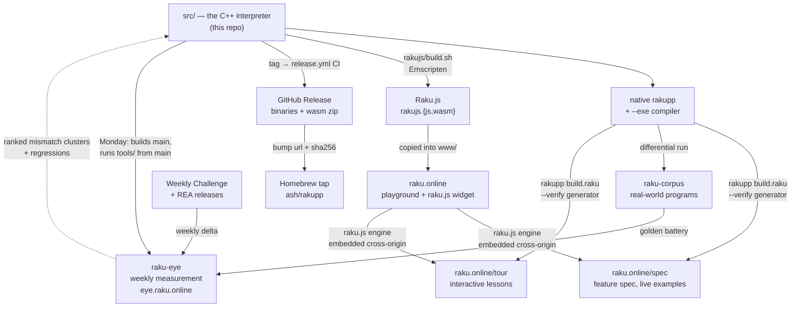

# The Raku++ ecosystem

Raku++ is not just the interpreter — it is the hub of a small constellation of
projects that all trace back to the same C++ source in [`../src`](../../src). This
page is the map: what each piece is, where it lives, and — crucially — **the
runbook for what to rebuild and redeploy after a release**, so nothing is left
on a stale interpreter.

## The pieces

Everything downstream ships the *same* interpreter. Raku.js is `../src` compiled
to WebAssembly; the two sites embed that WebAssembly; the Homebrew tap and the
GitHub Release distribute the native binary; the corpus is test input run against
it. There is one implementation behind every surface.

One piece points the other way. Every project below consumes the interpreter;
**raku-eye measures it** — weekly, unattended — and hands back a ranked list of
what to fix. Its design and rules live in
[dev/plans/RAKU-EYE-PLAN.md](../dev/plans/RAKU-EYE-PLAN.md).

| Project | What it is | Repository | Serves |
|---|---|---|---|
| **Raku++ (rakupp)** | The interpreter + native compiler in C++17. Source of truth for everything below. | [ash/rakupp](https://github.com/ash/rakupp) | native binary, `--exe` |
| **Raku.js** | `../src` compiled to WebAssembly (Emscripten) — Raku in the browser, no server. Additive: nothing in `../src` is modified. | (part of rakupp, [`rakujs/`](../../rakujs/README.md)) | `rakujs.{js,wasm}` |
| **raku.online** | The public playground built on Raku.js — editor, output pane, share/open links, an embeddable widget (`raku.js`). | [ash/raku.online](https://github.com/ash/raku.online) | [raku.online](https://raku.online/) |
| **spec** (was `raku-spec`) | The behavioural spec: one page per feature, every example runnable live (via raku.online's engine). Its generator is written in Raku and run *by* rakupp. | [ash/raku.online `sites/spec`](https://github.com/ash/raku.online/tree/main/sites/spec) | [raku.online/spec](https://raku.online/spec/) |
| **tour** (was `raku-tour`) | "A Tour of Raku": 18 interactive lessons, every example a live editor (raku.online's engine) with output verified against the interpreter. Same generator pattern as the spec. | [ash/raku.online `sites/tour`](https://github.com/ash/raku.online/tree/main/sites/tour) | [raku.online/tour](https://raku.online/tour/) |
| **raku-corpus** | Real-world Raku programs used as a beyond-Roast differential test target. | [ash/raku-corpus](https://github.com/ash/raku-corpus) | — (test input) |
| **raku-eye** | The standing watch: a weekly, unattended GitHub Actions run that measures `main` against fresh Weekly Challenge solutions, new ecosystem releases and the corpus, benchmarks it against the latest Rakudo release, and publishes the result. Measures only — it never edits the compiler, and there is no AI in it. | [ash/raku-eye](https://github.com/ash/raku-eye) | [eye.raku.online](https://eye.raku.online/) |
| **Homebrew tap** | The `ash/rakupp` tap — `brew install rakupp`. Apple Silicon gets the prebuilt release binary; Linux/Intel build from the source tarball; `--HEAD` builds from `main`. | [ash/homebrew-rakupp](https://github.com/ash/homebrew-rakupp) | `brew install rakupp` |

## How they connect



Two things are worth internalising because they drive the release runbook:

- **The version string flows from one place.** `rakujs/build.sh` reads the
  version out of [`../CMakeLists.txt`](../../CMakeLists.txt)
  (`project(RakuPP VERSION …)`) and bakes it into the WebAssembly build. Bump the
  version there *before* rebuilding wasm and every surface reports it correctly.
- **Neither the spec nor the tour hosts an engine of its own.** Their runnable
  examples load raku.online's `raku.js`, which `importScripts` the same
  `rakujs.{js,wasm}`. So **both sub-sites automatically inherit a new interpreter
  the moment raku.online is redeployed** — updating them is then only about the
  *content* (new feature pages / lessons), not the engine.
- **raku-eye reads this repo's `main`, including its tools.** The Monday run
  builds `main` and then drives `tools/pwc-sweep.raku`, `tools/run-bench.raku`
  and `tools/eco-fresh/` *from that same checkout* — the tools are also tests.
  So a driver that asks for a flag the pushed tool does not have is a red
  Monday, not a silent skip: **push a tool change before the Eye needs it**
  (the Eye's first run died exactly this way, on `exit 2` and a Usage block).
  The flow is one-way — the Eye has no write access here and no fixing logic;
  its output is a ranked list that a human fix session consumes.
- **One origin, one deploy, no CI build.** The spec and the tour were once
  separate repos on `spec.raku.online` and `tour.raku.online`, each with its own
  Pages workflow that downloaded a release binary and built itself. Both repos
  are gone; the sources live in `raku.online` under `sites/`, and raku.online's
  Pages workflow publishes `www/` **verbatim**. Whatever is not built locally and
  committed does not go live. Older notes describing a CI that builds the spec
  are describing the retired setup.

---

## Release runbook — what to rebuild after a new version

Do these in order. Steps A–B are required for every release; C is required
whenever the release adds or changes user-visible behaviour; D is a safety net.

### A. Cut the release (in this repo)

1. **Bump the version** — the single source of truth is
   [`CMakeLists.txt`](../../CMakeLists.txt): `project(RakuPP VERSION X.Y.Z …)`.
   Everything (native `--version`, the wasm build, doc footers) derives from it.
2. **Rebuild and re-gate** — `cmake --build build-arm64 --target rakupp`, then
   run the Roast harness and confirm zero fully-passing-file regressions
   (see [COUNTING.md](COUNTING.md)).
3. **Update `CHANGELOG.md`** — move the `## Unreleased` block to
   `## vX.Y.Z — <date>`.
4. **Refresh the stat/doc numbers** — README status table, ROAST/COUNTING/
   FEATURES/OVERVIEW/GUIDE/ROADMAP. (The full checklist of which files carry
   which numbers is the doc-sync discipline; grep the old figures to find every
   occurrence.)
5. **Re-run the benchmarks** — always, not just when a kernel *looks* like it
   moved: a perf regression can hide anywhere, and the release is exactly when to
   catch it (v0.9.1 shipped an O(n²) `~=` regression that only a benchmark run
   surfaced). Run both harnesses and update [BENCHMARKS.md](BENCHMARKS.md):
   ```sh
   build/rakupp tools/run-bench.raku        # interp / --exe / Rakudo kernels
   build/rakupp tools/run-optbench.raku     # --exe vs --exe -O
   ```
   Refresh both comparison tables, the `-O` table, the short-version bullets, the
   prose speed-ups, and the dated footer snapshot. If a number went the wrong way,
   fix the code before tagging — don't just record the regression.
6. **Push the commits FIRST, then tag** — `git push && git tag vX.Y.Z && git push --tags`.
   Order matters, and getting it wrong is expensive: a tag pushed ahead of its
   commits builds a release from whatever the branch held at that moment, and
   because **`releases/latest` follows publication TIME rather than version
   order**, a wrongly-published release keeps the `Latest` flag even after its
   tag is deleted — and `Latest` is what the Homebrew formula and the
   `setup-rakupp` Action install. Deleting the tag is not enough;
   delete the *release* (`gh release delete vX.Y.Z`) and confirm with
   `gh release list` that the flag moved. The
   [`release.yml`](../../.github/workflows/release.yml) CI then builds the
   binaries for macOS (universal), Linux (static), and Windows (MSVC + MinGW),
   **and** the `wasm` job builds `rakujs-<tag>.zip` (playground bundle) and the
   showcase bundle, attaching all of them to the GitHub Release. No manual
   binary building is needed.
7. **Bump the Homebrew formula** — in the [ash/homebrew-rakupp](https://github.com/ash/homebrew-rakupp)
   repo (`Formula/rakupp.rb`), after the Release CI (Step A.6) has published the
   assets. The formula pins the version in **three** places — all must move together:
   - top-level `url` → `…/archive/refs/tags/vX.Y.Z.tar.gz` + its `sha256`
     (the **source** tarball, used by the Linux/Intel build-from-source path);
   - the `on_macos` block's `url` → `…/releases/download/vX.Y.Z/rakupp-macos-universal.tar.gz`,
     its `sha256`, and `version "X.Y.Z"` (the **prebuilt** Apple-Silicon binary).

   Compute each hash straight from the published asset, e.g.:
   ```sh
   curl -sL https://github.com/ash/rakupp/archive/refs/tags/vX.Y.Z.tar.gz | shasum -a 256
   curl -sL https://github.com/ash/rakupp/releases/download/vX.Y.Z/rakupp-macos-universal.tar.gz | shasum -a 256
   ```
   Then `brew install --build-from-source rakupp` and `brew test rakupp` to
   verify before committing and pushing the tap. (The `head "…"` line needs no
   change — `--HEAD` always tracks `main`.)

### B. Regenerate the WebAssembly and update raku.online

This repo's CI attaches a wasm zip to the Release, but the **live playground is
published from the `ash/raku.online` repo**, whose own Pages workflow serves
`www/` — so the artifacts have to be rebuilt here and copied there by hand. The
publish itself is that repo's push, not anything in this one.

1. **Build native rakupp first** (Step A already did this) — `build.sh` uses it
   to regenerate `examples.js` from `examples/*.raku`. **Check which binary it
   picks**: it searches `build/rakupp`, then `build-arm64/rakupp`, then
   `./rakupp`, and takes the first that exists — so a stale `build/` shadows the
   one you just built. Either pass it explicitly or verify the line it prints:
   ```sh
   RAKUPP=build-arm64/rakupp rakujs/build.sh     # or: check "==> generating examples.js with …"
   ```
2. **Build the wasm** — from this repo:
   ```sh
   rakujs/build.sh          # → rakujs/playground/rakujs.{js,wasm} + examples.js
   ```
   (Bootstraps Emscripten into `rakujs/emsdk/` on first run; `-Oz` release build.
   The version string is baked from `CMakeLists.txt`, so Step A.1 must precede this.)
3. **Copy the built artifacts into the site** — into the `raku.online` checkout's
   `www/`: `rakujs.js`, `rakujs.wasm`, `examples.js` (always), plus
   `worker.js`/`index.html` **only if** they changed upstream in
   `rakujs/playground/` (raku.online keeps its own branded `index.html`).
4. **Stamp the cache tag** — from the `raku.online` checkout:
   ```sh
   ./deploy.sh
   ```
   Its job that still matters is the **content-hash `?v=` tag** it writes into
   `index.html`/`raku.js`, so browsers refetch the new wasm. (It also rsyncs to
   an sshfs mount, which is a leftover from when the site was served from that
   server — see below.)
5. **Commit and push** the `raku.online` repo. **This is the publish**: the site
   is served by **GitHub Pages** from `www/`, via
   [`.github/workflows/pages.yml`](https://github.com/ash/raku.online/blob/main/.github/workflows/pages.yml),
   which runs on every push to `main`. Copying to the sshfs mount does *not*
   update the live site — `curl -sI https://raku.online/` answers
   `server: GitHub.com`. Verify after the Pages run finishes:
   ```sh
   curl -s https://raku.online/ | grep -o '?v=[0-9a-f]\{8\}' | head -1   # matches the tag deploy.sh printed
   ```

### C. Update the spec for the new feature list

The spec uses the engine in **two** places, and they update on different
schedules — worth keeping straight:

- the **live examples** a reader runs in the browser load raku.online's
  `raku.js`, so they inherit the new engine as soon as Step B ships;
- the **build-time verification** runs against whichever binary you point
  `RAKUPP` at when you build locally — so it is the engine you just cut only if
  you say so.

What remains for you here is **content** — documenting features the release
newly supports. The *data* behind the graphs and listings (conformance,
divergences, the Roast map, the dashboard timeline) is a separate step, and it
runs after the tag: see step 5 of [dev/RELEASING.md](../dev/RELEASING.md).

1. **Author/update feature pages** — one Markdown-ish file per feature under
   the spec site's `sites/spec/src/pages/<category>/<slug>.md` (categories: `literals`,
   `operators`, `types`, `variables`, `control`, `subs`, `methods`, `builtins`,
   `regexes`, `phasers`, `concurrency`). Give each a ```` ```raku ```` example and,
   where deterministic, a matching ```` ```output ```` block — the build verifies
   these against the real interpreter. Update `status:` (`full`/`partial`/
   `divergent`/`ni`) for features whose support level changed.
2. **Build + verify locally** — from `sites/spec/` in the raku.online checkout:
   ```sh
   rakupp build.raku --clean --verify     # every example run through rakupp
   rakupp rules.raku                      # the /rules sub-site
   ```
   Every example is executed through rakupp (and the Rakudo oracle, if
   `ORACLE=raku`); **any drift fails the build**, so the spec can never
   contradict the shipped interpreter.
3. **Assemble and publish** — from the root of the raku.online checkout:
   ```sh
   ./build.sh spec        # sites/spec -> www/spec
   ```
   then commit `www/` **together with** `sites/spec/`, and push. **That is the
   publish**: Pages serves `www/` verbatim and builds nothing, so a commit of the
   sources alone changes nothing a visitor sees. This is the one mistake the
   split between `sites/` and `www/` invites.

**The tour** ([ash/raku.online `sites/tour`](https://github.com/ash/raku.online/tree/main/sites/tour))
works exactly the same way — `./build.sh tour`, commit `www/`, push — and
re-verifies every lesson against your `RAKUPP` as it builds. After a release with
no content change, rebuild it once anyway so the lessons are re-verified against
the new interpreter. `./build.sh` with no argument does the whole site.

(The in-browser engine updates with raku.online, same as the spec.)

### D. Differential-check against raku-corpus

Optional but recommended: run the new binary over
[raku-corpus](https://github.com/ash/raku-corpus) to catch real-world
regressions that Roast's unit granularity misses. This is a test pass, not a
deploy — nothing to publish, just a signal before (or right after) tagging.

**raku-eye already does this every Monday**, so the question at release time is
narrower: has the Eye run since the commits you are about to tag? Check
[eye.raku.online](https://eye.raku.online/) — the corpus line should hold or
climb and the regression box should be empty. If the release lands mid-week,
either run the corpus leg by hand as above or trigger the Eye off-schedule:

```sh
gh workflow run weekly --repo ash/raku-eye
```

That is a measurement, not a publish decision: the Eye records the number that
came out, so a bad week appears in the ledger either way.

---

## Quick reference

| I changed… | …so I must |
|---|---|
| the interpreter (`src/`) | bump `CMakeLists.txt`, re-gate Roast, rebuild wasm (**B**), redeploy raku.online (**B**) — the spec then picks up the engine for free |
| example programs (`examples/`) | rebuild wasm so `examples.js` regenerates (**B.2**), redeploy raku.online (**B**) |
| the playground UI (`rakujs/playground/`) | copy the changed file into `raku.online/www/` and redeploy (**B.3–4**) |
| a feature's support level or a new feature | write/update its spec page and redeploy the spec (**C**) |
| a tour lesson | `./build.sh tour` in the raku.online checkout, commit `www/`, push (**C**) |
| stat numbers (Roast) | refresh the docs per the doc-sync checklist (**A.4**) |
| a sweep tool (`tools/pwc-sweep.raku`, `tools/run-bench.raku`, `tools/eco-fresh/`) | push it to `main` before the next Monday — raku-eye runs the tools from `main`, so an unpushed change is a failed run (**D**) |
| anything, and you want to know what it broke in the wild | read [eye.raku.online](https://eye.raku.online/) — the week's regressions and the ranked mismatch clusters are the fix-session worklist (**D**) |
| the interpreter, at release time | re-run both benchmark harnesses and update BENCHMARKS.md — every release, not just when a kernel looks moved (**A.5**) |
| cut a new version tag | bump the three pins in the Homebrew formula once CI has published the assets (**A.7**); rebuild the tour so its lessons re-verify on the new binary (**C**); republish the site data (**[RELEASING.md](../dev/RELEASING.md) step 5**) |
